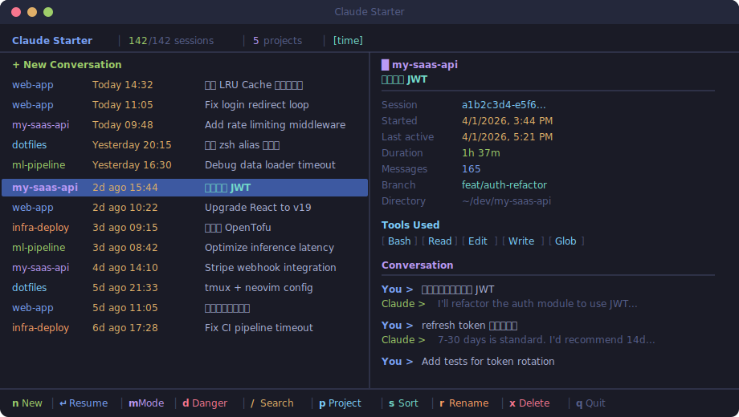

<p align="center">
  
  <br/>
  
  
  
  
</p>

<h1 align="center">🚀 Claude Starter</h1>

<p align="center">
  <strong>Your homepage for Claude Code.</strong> All your sessions, at a glance.
</p>

<p align="center">
  <code>git clone</code>&nbsp;&nbsp;→&nbsp;&nbsp;<code>npm link</code>&nbsp;&nbsp;→&nbsp;&nbsp;<code>start-claude</code>
</p>

<p align="center">
  <a href="./README_CN.md">🇨🇳 中文文档</a>
</p>

<p align="center">
  
</p>

---

## The Problem

Claude Code's `/resume` gives you a wall of UUIDs:

```
? Select a conversation
  3ee0f33a-b882-424f-9ba4-260342e4dd5b - 4/3/2026, 10:53:41 AM
  87570bab-ee92-4681-9591-54abf2fcb486 - 4/3/2026, 10:18:55 AM
  716f7cd7-27fd-41dd-94eb-a169b6058f8a - 4/3/2026, 10:50:10 AM
  ...200 more UUIDs...
```

Good luck finding that session where Claude fixed your auth bug last Tuesday.

## The Solution

```bash
start-claude
```

Beautiful split-pane UI with Tokyo Night colors. The left panel shows every session with project, time, and topic. The right panel previews the full conversation. Not UUIDs — your **actual words**.

## 🔍 Search — The Killer Feature

Press `/` and start typing. **That's it.** No Enter needed.

Searches across **everything** — project names, Git branches, conversation content. Results update as you type, `↑↓` to navigate instantly.

- `auth` → all auth-related sessions
- `refactor` → that cleanup from last week
- `web-app fix` → bug fixes in a specific project

**No modes. No confirmation. Just type and go.**

## Features

| | Feature | Description |
|---|---|---|
| 🎨 | **Beautiful TUI** | Tokyo Night color scheme, split-pane layout, feels native in your terminal |
| ✨ | **New Session** | Launch a fresh conversation in one keystroke |
| 🔍 | **Instant Search** | Fuzzy search across everything, no Enter needed |
| 📂 | **Project Filter** | Press `p` to filter by project |
| ⚡ | **One-Key Resume** | Arrow, Enter, you're back in the conversation |
| 📋 | **Session Preview** | Full metadata + conversation history in the right panel |
| 🔀 | **Sort Modes** | Sort by time, size, messages, or project |
| 📎 | **Copy ID** | Press `c` to copy session ID |
| 🧠 | **Smart CLI** | Auto-detects `mai-claude` vs `claude` |
| 🔒 | **100% Local** | No network, no telemetry, no data leaves your machine |

## Install

```bash
git clone https://github.com/Bojun-Vvibe/claude-starter.git
cd claude-starter
npm install
npm link
```

Then run:

```bash
start-claude
```

## Usage

```bash
# Interactive TUI — the main experience
start-claude

# Quick table view (pipe-friendly)
start-claude --list
start-claude --list 50

# Help
start-claude --help
```

## Keyboard Shortcuts

| Key | Action |
|:---:|--------|
| `↑` `↓` | Navigate sessions |
| `Enter` | Start new / resume selected session |
| `n` | New session |
| `/` | Search |
| `Backspace` | Edit search, auto-exit when empty |
| `Esc` | Clear filter |
| `p` | Filter by project |
| `s` | Cycle sort mode |
| `c` | Copy session ID |
| `Home` / `End` | Jump to first / last |
| `Ctrl-D` / `Ctrl-U` | Page down / up |
| `q` / `Ctrl-C` | Quit |

## How It Works

Reads the JSONL session files from `~/.claude/projects/`, parses metadata (timestamps, git branch, working directory) and conversation content.

200 sessions load in ~10ms. Two-pass strategy: quick head/tail reads for the list, full parse only for the selected session.

**Everything stays local. No API calls, no telemetry, no network.**

## Requirements

- **Node.js** >= 18
- **Claude Code** ([`claude`](https://docs.anthropic.com/en/docs/claude-code) in PATH)

## License

MIT

---

<p align="center">
  <sub>Built with 💜 by <a href="https://github.com/Bojun-Vvibe">Bojun</a> — powered by Claude Code itself</sub>
</p>
